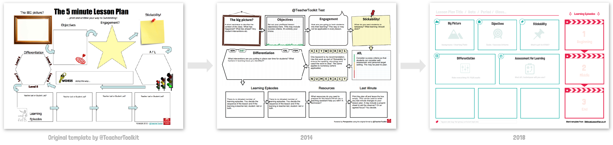
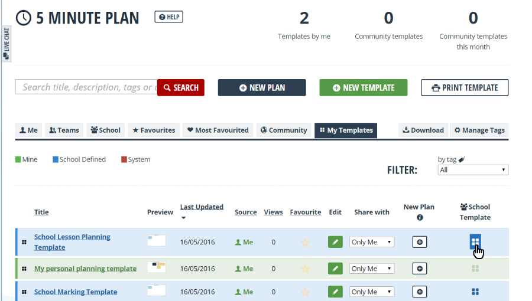
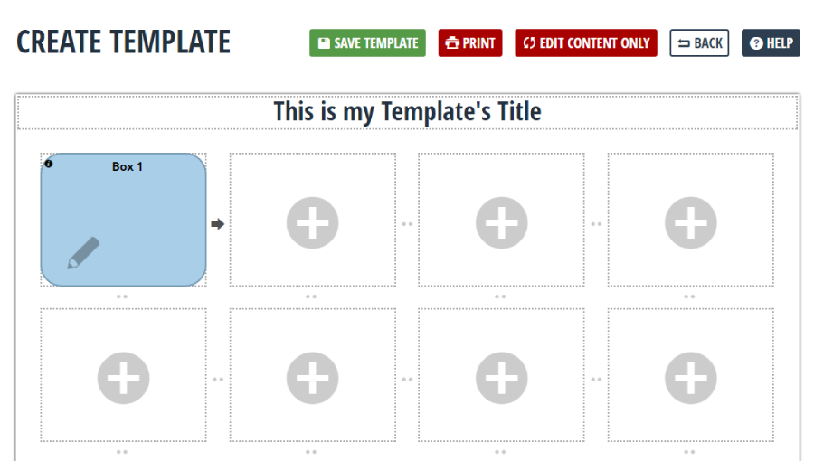
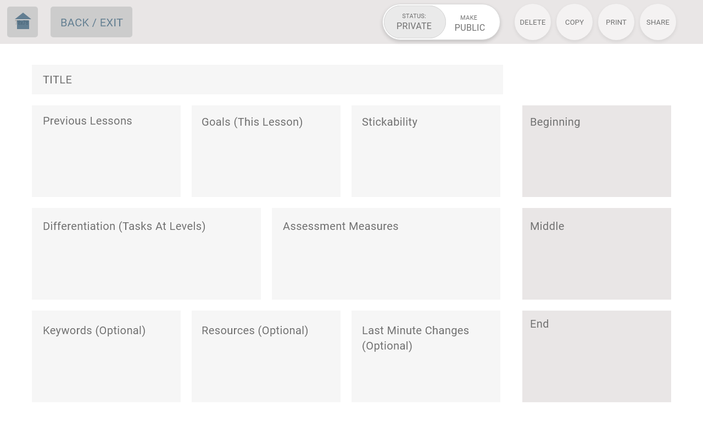
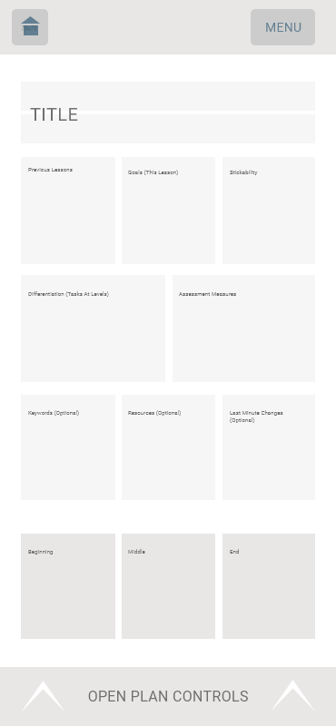
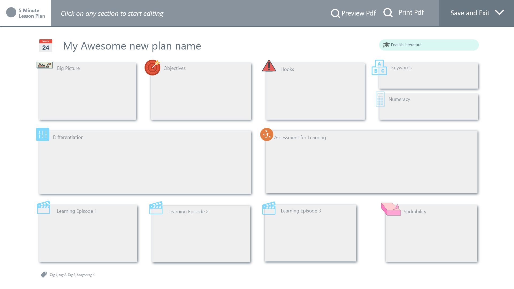
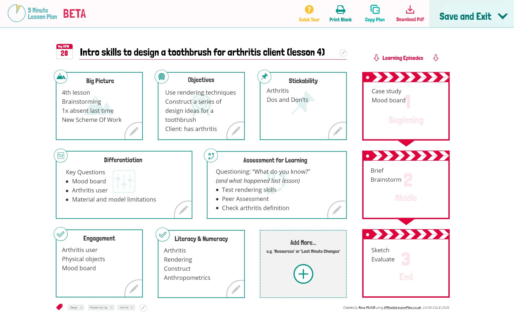
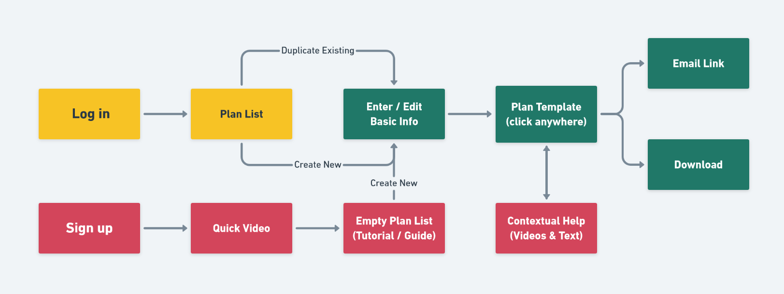
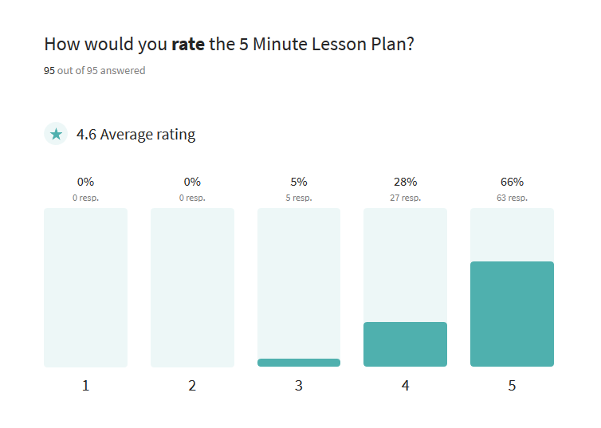

	<h2 class="p-main-heading">
		Project Background
	</h2>

	<h3>The Brief</h3>
	
Transform the 5 minute lesson plan template into a mobile-friendly digital tool

	In summer 2018, I was tasked with completely re-designing an existing online lesson planning tool for teachers based around the hugely popular 5 Minute Lesson Plan Word document template. 

	Attempts had been made to digitize the 5 Minute Lesson Plan template before (in 2014). However, business needs at the time had led to it being incorporated into another app that was primarily used by school managers (not teachers). 

	This led to a <strong>confusing user journey</strong> where teachers would subscribe under one branded website but had to log in via a separate (and potentially unknown) product's website.

<h4 class="img-grid-title">
	Previous versions of the 5 Minute lesson Plan:
</h4>

	<strong>Subscription renewal rates had slowed to a trickle</strong> for the existing online tool and feedback surveys revealed a frustrated user-base.

<h4>
	Pain points:
</h4>
<ul>
	<li>A confusing sign-up / login journey </li>
	<li>Complicated template options </li>
	<li>Confusing 'community sharing' feature</li>
	<li>Didn't work on mobile devices</li>
	<li>More expensive than other single-purpose tools for teachers</li>
</ul>

	<h3>Goals & Requirements</h3>
	
Fix the problems from previous versions: Make it simple, affordable and responsive

In consultation with stakeholders, I narrowed down a list of requirements.

	

		<h4>Essentials</h4>
		<ul>
			<li>Stand-alone web-based app</li>
			<li>Works on mobiles, tablets and desktop</li>
			<li>Users can download a one-page pdf of their lesson plan</li>
			<li>5 minutes to complete a plan</li>
		</ul>
	

	

		<h4>Desirables</h4>
		<ul>
			<li>New template but recognisable</li>
			<li>Include best practice guidance </li>
			<li>Not specific to UK education framework</li>
			<li>Free version + subscription extras</li>
		</ul>
	

	It was important to keep <a href="https://www.teachertoolkit.co.uk/" target="_blank" rel="noopener noreferrer">TeacherToolkit</a>, the 5 Minute Lesson Plan's founder happy, especially during the design phase. <strong>Existing users</strong> also needed to be kept engaged if we were to keep them as customers in future.

	One more consideration: Angel Solutions was footing the whole bill for this build and offering a generous commission back to the founder once the product went live. <strong>We had to keep costs in mind!</strong>

	

		<h2 class="p-main-heading">My Role: Project Lead</h2>
		

			<strong>Despite my expansive roles on this one, it really was a team effort.</strong> I had the pleasure of working closely with a very talented developer called <a href="" target="_blank" rel="noopener noreferrer" >Ryan Simpson</a> throughout this project. We also had help along the way from the <a href="" target="_blank" rel="noopener noreferrer" >Angel Solutions</a> team - you know who you are.
		

		

			

				

					<h4>Product Design</h4> 
					

						I was the only designer. After initial sign-off, I held regular design review sessions with the wider design team, which was invaluable in refining and improving the UI.
					

				

			

			

				

					<h4>User Research</h4>
					

						I conducted, collated and presented to key stakeholders.
					

				

			

			

				

					<h4>Front End</h4>
					
I wrote all CSS, most HTML and some javascript in Vue.js templates. 

				

			

			

				

					<h4>Tech Stack Decisions</h4>
					

						Alongside Ryan, we chose to use Vue.js with webpack on the front end
					

				

			

		

		

			<strong>Note:</strong> Other talented folk handled all the design, development and content for the marketing website. Kudos! :)
		

	

	<h2 class="p-main-heading">
		Step-by-step process
	</h2>

<!-- 
 -->

	<h3 class="lede steps__title">
		Research
	</h3>
	
1-2 weeks

	Although no budget was assigned for research, it's too essential to skip! I used quick Typeform surveys to get some design steer from teachers in our target user-base, both existing and potential customers.

<blockquote class="blockquote float-right">
	I want a template that's easy to follow, and easy to share with my observer or colleagues
	<footer>&mdash; A user persona statement</footer>
</blockquote>

	From the research, I was able to crystalise the problems we were trying to solve and understand more about the lesson planning process. I even read the Mark, Plan Teach book by Teacher Toolkit to better understand those we were trying to help.

	<h4>What matters most to our users:</h4>
	<ul>
		<li>Speed of planning</li>
		<li>Ease of sharing</li>
	</ul>

	<h3 class="lede steps__title">
		Design & Wireframe
	</h3>
	

		4 weeks
	

	I prioritised designing the lesson plan template and how it would look on different devices, as the whole product hinged on that.

<h4 class="img-grid-title">
	Some early designs:
</h4>

	<strong>In retrospect, I should have spent more time at this stage mapping out the user journeys and nailing down the feature list with the product owners.</strong>

	As it was, we ended up starting the build with features not yet agreed.

<h4 class="img-grid-title">
	Basic journey map:
</h4>

<h4>Research continued&hellip;</h4>

	Throughout this design phase, I sought out design feedback as much as possible, kept surveying users, and ran impromptu focus groups whenever teachers and education leaders were visiting the office.

	<h3 class="lede steps__title">
		Build 
	</h3>
	

		2 months (alongside other projects)
	

**Ryan and I chose to use Vue.js as the backbone to this project**, for speed and to give it the potential to become a progressive web app with service workers (for offline access() at a later date. 

My primary role was to write mobile-first modular scss using the BEM naming framework (so the stylesheet would feel similar to our other products when colleagues needed to work on it), end embracing modern CSS techniques. 

For example, the lesson plan template lended itself easily to CSS Grid. Anything that doesn't support CSS Grid, like older Internet Explorer, received a flexbox fallback.

	

		<h4>I love CSS, but&hellip;</h4>
		

			This was a fantastic opportunity for me to solidify and test my front end knowledge. I pushed myself to do contribute to writing and debugging some javascript, having little experience before.
		

		

			Additionally, this was my first experience using a modern javascript framework and I was delighted with it! 
		

	

	

		

			<h4>
				Key learnings: 
			</h4>
			<ul>
				<li>CSS Grid</li>
				<li>Vue.js basics</li>
				<li>Print to pdf</li>
				<li>Git in the console</li>
			</ul>
		

	

	<h3 class="lede steps__title">
		Beta Test
	</h3>
	

		4 months (in length)
	

	In October 2018, we launched a free version of the app to our beta group and set about getting their feedback while continuing to design and develop features, including:

<ul>
	<li>Subscription & payment screens</li>
	<li>Free trial and renewal reminders</li>
	<li>Marketing automated email strategies</li>
	<li>System messages and help</li>
</ul>

<h4 class="img-grid-title">
	Beta feedback:
</h4>

	<h4>
		Beta summary: 
	</h4> 
	<ul>
		<li>200+ users</li>
		<li>4.6/5 average rating</li>
		<li>99% accessible</li>
		<li>90% mobile usage</li>
	</ul>

<h4 class="">
	Full launch
</h4>

	The <a href="https://app.5minutelessonplan.co.uk/register" target="_blank" rel="noopener noreferrer" class="link">new 5 Minute Lesson Plan</a> launched in Feb 2019, <strong>gained 4000+ paying subscribers within the first 2 months</strong> and maintained an impressive 5-star review rating throughout that time. 

	<h3 class="lede steps__title">
		Review & learn
	</h3>
	

		Ongoing
	

<blockquote class="blockquote float-right">
	More important than anything else, was discovering how much I <strong>love</strong> working on products that are <strong>aiming to help people</strong>.
	<footer>
	&mdash; Grace
	</footer>
</blockquote>

	On a practical level, I learnt so much from this project. From design, to teamwork, to presentation skills, to CSS and javascript&hellip; I can confidently say my skills improved in every area.

<h4 class="mb">
	Things I would do differently
</h4>

	

		

			<h5>
				More wireframes
			</h5>
			

				I started designing some screens in the browser. Not a great idea. Even basic wireframes would have saved me time here.
			

		

	

	

		

			<h5>
				Confirm an MVP Feature list
			</h5>
			

				Some mis-communication with a decision-maker meant we lost time developing features that weren't needed.
			

		

	

	

		

			<h5>
				Design filters
			</h5>
			

				I should have gone with my gut and built filters into the lesson plan index to make them easier to find. In fact, I would design that whole screen differently!
			

		

	

