<h2 class="p-main-heading">
	Project Background
</h2>

	<h3>The Brief</h3>
	
Build out two versions of a restyled registration form and measure which one is more successful

Park Christmas Savings is an unusual ecommerce site where users choose to purchase gift currency or physical products in advance, paying into their account regularly so they are ready for the following Christmas. **The site is built in Java, uses an old version of the bootstrap framwork, and calls numerous separate CSS and jQuery files on each page.** It has an accompanying mobile app (built using Ionic v1), however registration only takes place on the website, so that was the focus of this project.   

**Product owners had noticed the 'Easy Sign Up' journey wasn't performing as well as expected, with a high number of page visits, but low completion rates.**

<h4 class="img-grid-title">
	Original sign up form:
</h4>

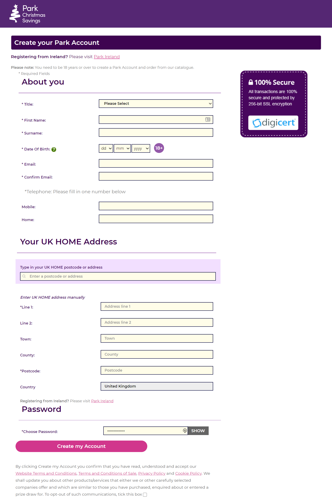

We worked with a third party supplier to provide us with two designs for a new sign up form, both of which included beutified form components and live validation features. We would then use Google Optimize to split traffic between these forms and measure their completion stats.

<h4>3 versions to be tested:</h4>
<ul class="list--chevrons">
<li>New form components all in one long form, on one page</li>
<li>New form components split over three pages with a progress bar at the top</li>
<li>The original registration form using default form elements and no client-side validation</li>
</ul>  

	<h3>Goals & Requirements</h3>
	
Build the forms, create re-usable styles and validation patterns at the same time

My role was to build out the Figma design files I'd received - A simple job, really. 

However, **I saw this as an opportunity to streamline some of the multiple CSS files into one, make use of variables for repeating tokens like colors, spacing and focus states, and create some reusable form component styles, even though the project doesn't yet have a component-based architecture.**

<h4 class="img-grid-title">
	New Scss imports:
</h4>

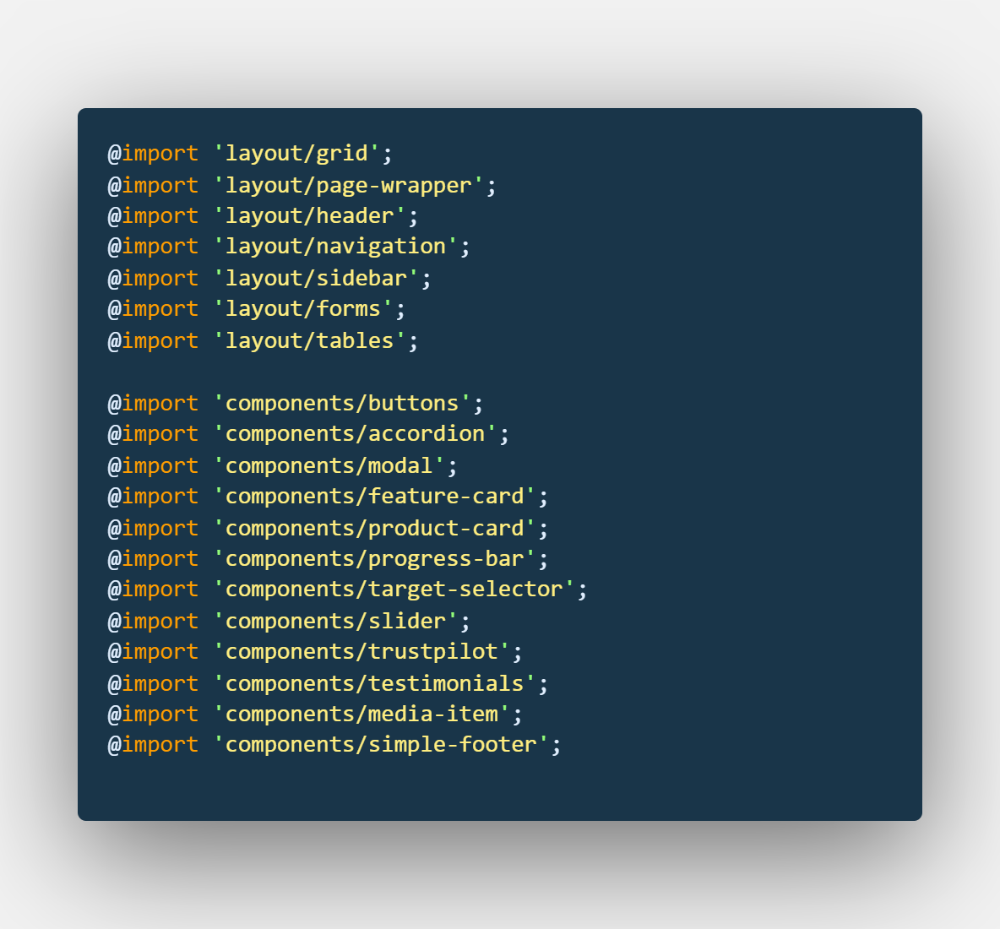

<h4 class="img-grid-title">
	Sass color variables:
</h4>

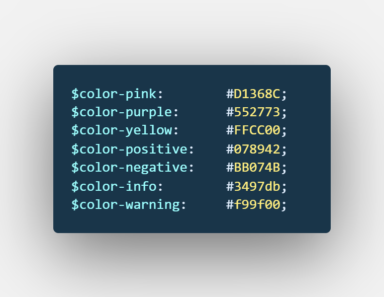

We were somewhat limited by the existing tech. For example, having to build the new forms inside existing page templates limited the improvements I could make to things like page speed and performance. We also had to duplicate code across pages due to the way the URLs were being created for the A/B test. 

**Nevertheless, there were plenty of accessibility, usability and frontend architecture improvements to be made!**

	

		<h4>Essentials</h4>
		<ul>
			<li>Build form components to match the designs</li>
			<li>Include address lookup functionality</li>
			<li>Ensure client-side form validation rules match those on the server</li>
			<li>Give visual feedback as users complete the form</li>
		</ul>
	

	

		<h4>Desirables</h4>
		<ul>
			<li>Make the form accessible to keyboards and assistive technology</li>
			<li>Include well-written feedback or error messages</li>
			<li>Make use of native input validation (e.g. required, or Regex completion patterns)</li>
			<li>Create reusable form styles in Sass</li>
			<li>Start using a new global CSS file</li>
		</ul>
	

	

		<h2 class="p-main-heading">My Role: Front End</h2>
		

			I worked with a great Java/fullstack developer called Emilia to build the forms. She set up the pages and handled address lookup functionality, I did all HTML and Sass, and we both contributed to the jQuery form validation together. 
		

		

			

				

					<h4>HTML</h4> 
					

						I ensured we used good semantic structure for the form: Correct input types, autocomplete attributes, linked labels etc. I also ensured error messages were properly associated to and displayed next to their inputs. 
					

				

			

			

				

					<h4>Sass and CSS</h4>
					

						As part of this project, I started moving product styles into scss, using Gulp to compile the stylesheets and sourcemaps. We now have a sass file for form elements and I have since begun implementing these new styles on forms throughout the product.
					

				

			

			

				

					<h4>jQuery</h4>
					
We chose to validate form fields on-blur. I helped write and bug-fix these validation checks.

				

			

			

				

					<h4>Google Optimize</h4>
					

						I worked with the UX team to implement the A-B-C test using Google Optimize.
					

				

			

		

	

<h2 class="p-main-heading">
	Step-by-step process
</h2>

	<h3 class="lede steps__title">
		Basic Form Structure
	</h3>
	
1 day

My first step was to look through the Figma design files, mobile and desktop, and list out the form components needed. 

<h4 class="img-grid-title">
	Some newly-designed components:
</h4>

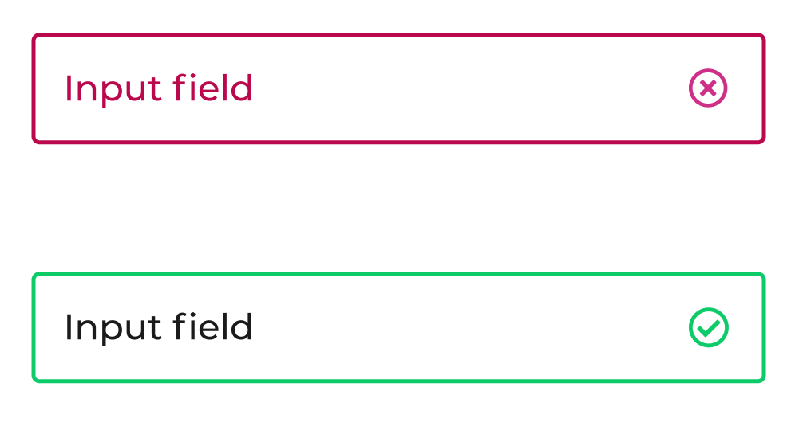

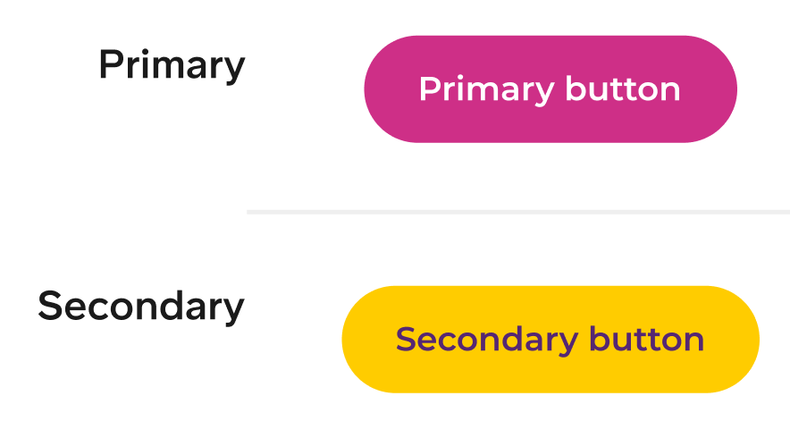

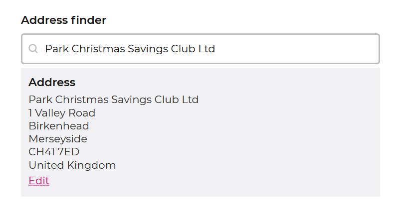

<h4 class="img-grid-title">
	Simple html for an email input:
</h4>

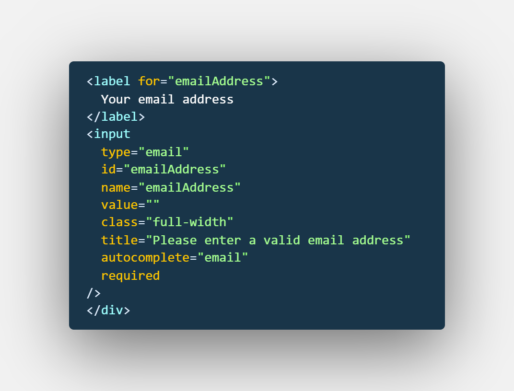

As these designs were part of an ongoing wider re-design of the product, I knew that every element would need new styles writing. Alongside each form element, **I noted down different the states and validation styles required**. 

Next came the basic html for the form, all in one page first (the split, three-stage version could be done after).

	<h3 class="lede steps__title">
		Styling
	</h3>
	

		3-5 days
	

I had already begun tidying up the projects styles and moving them into a scss-Gulp workflow. After writing general styles for all labels and inputs, including focus and hover states following a BEM naming convention, I focussed on more bespoke elements.

<!-- 
 -->

For example. the designs featured a beautiful-looking dropdown Select, which are notoriously difficult to style consistently accross browsers.

<h4 class="img-grid-title">
	Styled select element:
</h4>

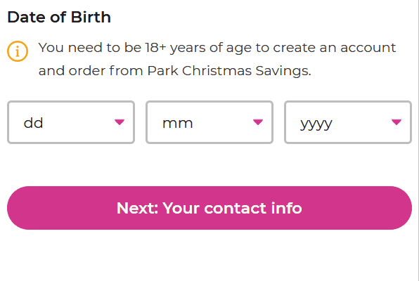

**As this project needed doing quickly, I chose in this one case only to reach for an existing third party component which I know has good cross-browser behaviour and would need less testing than a component built out from scratch.** I adjusted the scss for Select-2 to meet our needs and think this was a good decision for the project. 

**Throughout the styling stage, I tried to make sure the scss remained as reusable as possible, so that we could leverage the same classes in forms elsewhere on the site later on.**

	<h3 class="lede steps__title">
		Field Validation
	</h3>
	

		1-2 days
	

We reused some existing jQuery from another project, but re-wrote it to fit the validation rules for this project (e.g. the password requirements) and to give more user-feedback by adding/removing classes that would change the appearance of the inputs on blur.

**I spoke to the designers about tweaking the design to give more visual feedback to users** and created some svg icons of check and cross marks to accompany the changing colors on the form fields.

<h4 class="img-grid-title">
	An example validation rule:
</h4>

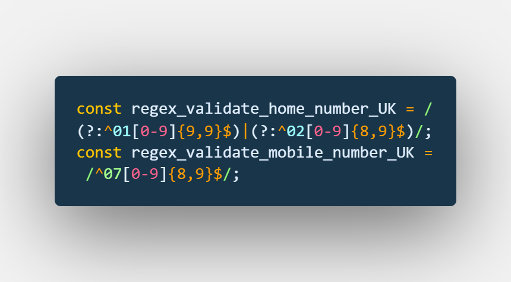

<h4 class="img-grid-title">
	Inline password validation:
</h4>

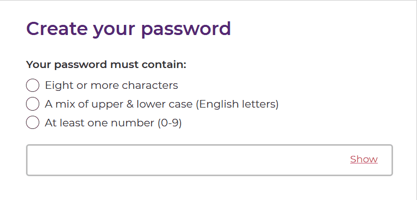

As my experience with jQuery was quite limited, I probably would have preferred to write the form validation in vanilla JavaScript. However, we had a base of jQuery to work with already, so I was happy to build on that in this case. 

	<h3 class="lede steps__title">
		A-B-C Test
	</h3>
	

		2 weeks
	

We set up the test using Google Optimize. After initially sending just 10% of traffic to the new pages for a day, to check everything was working as expected, we began the test properly. One third of traffic was sent to each of the new forms, with the remaining third going to the original form, as a comntrol. 

**Unsurprisigly, the new forms both had a significantly higher completion rate than the original.**

After 16 days, we analysed the results and I was pleasantly surprised to find that the three-step form had won the test. Easy sign up completion was 20% higher with this form. 

We continued the test for a further two weeks and this positive result remained. Following this confirmation, we did a full production release so that all traffic passes to the winning form and closed the Optimize test. 

	<h3 class="lede steps__title">
		Review & learn
	</h3>
	

		Ongoing 
	

I enjoyed my first project on Park Christmas Savings. I learnt some jQuery, improved my form building and validation skills, and was able to start sharing my CSS and scss knowledge with others in the team.

<h4 class="mb">
	Things I would do differently
</h4>

	

		

			<h5>
				Birthdate input 
			</h5>
			

				Although honouring the designs, I don't think a birdthdate input needs to be presented as three Selects. I would discuss and suggest alternatives with the designer. 
			

		

	

	

		

			<h5>
				React not jQuery 
			</h5>
			

				If this was a new project, I would much rather use a modern JavaScript framework like React or Vue so that styling and state could be bound using props (see example below).
			

		

	

<h4 class="img-grid-title">
	A React form input example I wrote: 
</h4>

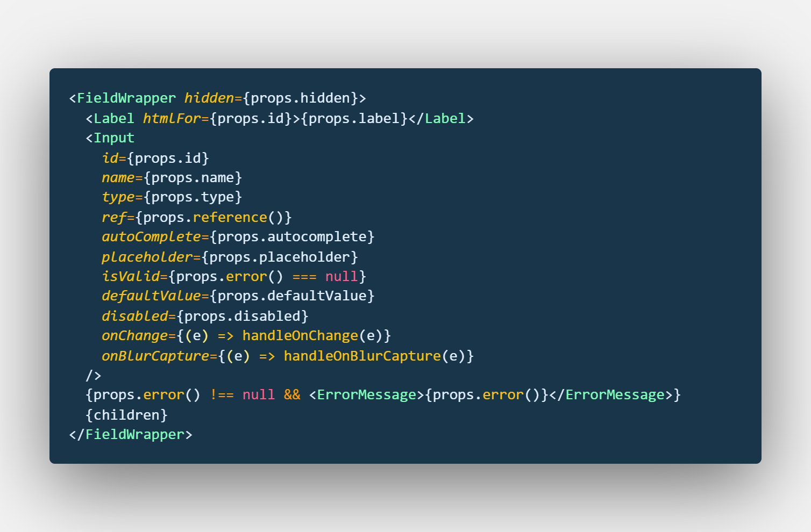

